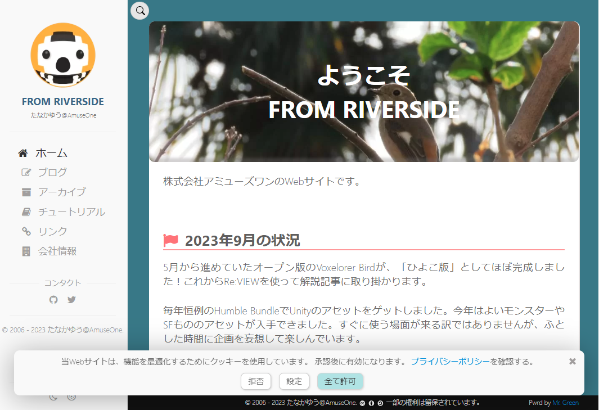
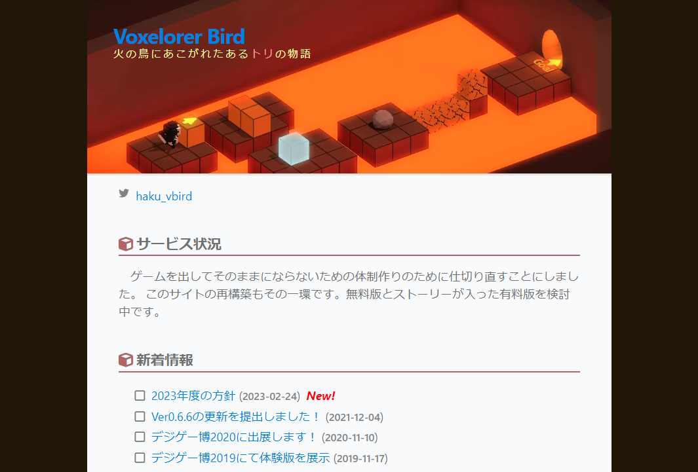
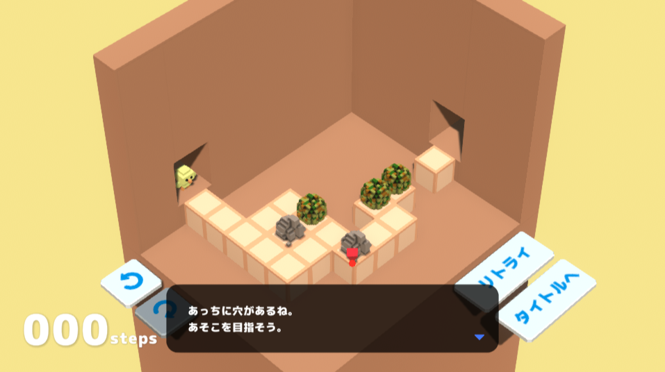
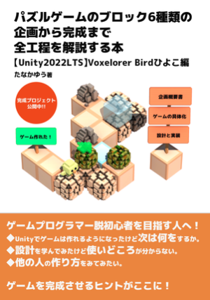

# Portfolio

- たなかゆう
- 連絡先 Email [a@a.a](mailto:a@a.a)
- 専門学校デジタルアーツ東京 ゲームプログラムコース 2025年卒業予定

## スキル
- C#
  - 利用歴10年以上
  - Unityで利用。Visual Studioでアプリ開発可能
- Unity
  - 利用歴10年以上
  - オリジナルの個人/チーム作品の開発経験あり
- Jekyll
  - 利用歴1年
  - 自分のWebサイトを作成
- Re:VIEW
  - 利用歴半年
  - 技術書を自費出版

## 取り組んでいるテーマ
1. Godotのシェーダー
1. オリジナルパズルゲームの企画・開発
1. 技術書執筆

## 作品リスト

### 【Jekyll】

[FROM RIVERSIDE](https://am1jp/)

自分のWebサイト。

- 開発環境：Jekyll + テーマ:Mr.Greenをアレンジ
- 開発期間：2023年4月 3週間程度

### 【Voxelorer Bird公式サイト】

[Voxelorer Bird公式サイト](https://vbird.am1.jp/)

- 開発環境：Jekyll
- 開発期間：2023年4月 1週間程度

### Voxelorer Birdひよこ編

[Voxelorer Birdひよこ編](https://github.com/am1tanaka/VBirdHiyoko)

行き先や押したいブロックをクリックして、ゴールを目指すパズルゲームです。
素材ごとUnityプロジェクト一式を公開しています。

- 開発環境：Unity2022LTS
- 開発期間：2023年5月-9月 5ヶ月程度

### パズルゲームのブロック 6 種類の企画から完成まで全工程を解説する本～【Unity2022LTS】Voxelorer Bird ひよこ編～

[技術書典マーケット](https://techbookfest.org/product/nQdhDsspFhjK7zfWzmZMwK?productVariantID=sWDuj5pHYbhWUTnjvd83XT)

Voxelorer Birdひよこ編について、6種類のブロックの開発工程を企画構想書から実装まで解説した本。

- 開発環境：Re:VIEW
- 開発期間：2023年8月-11月 2ヶ月半程度

## 連絡先
- Webサイト [FROM RIVERSIDE](https://am1.jp)
- ブログ [tanaka's Programming Memo](https://am1tanaka.hatenablog.com/)
- Twitter [@am1tanaka](https://twitter.com/am1tanaka)
- E-mail [a@a.a](mailto:a@a.a)

